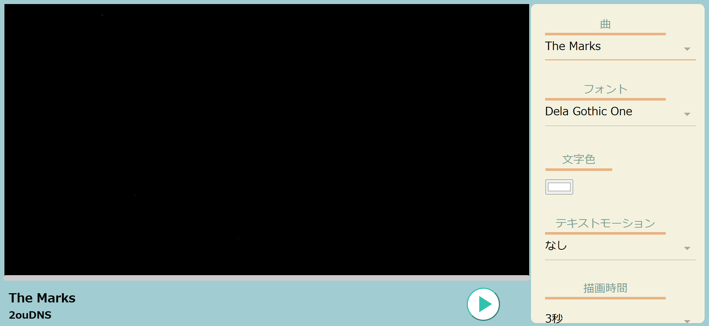
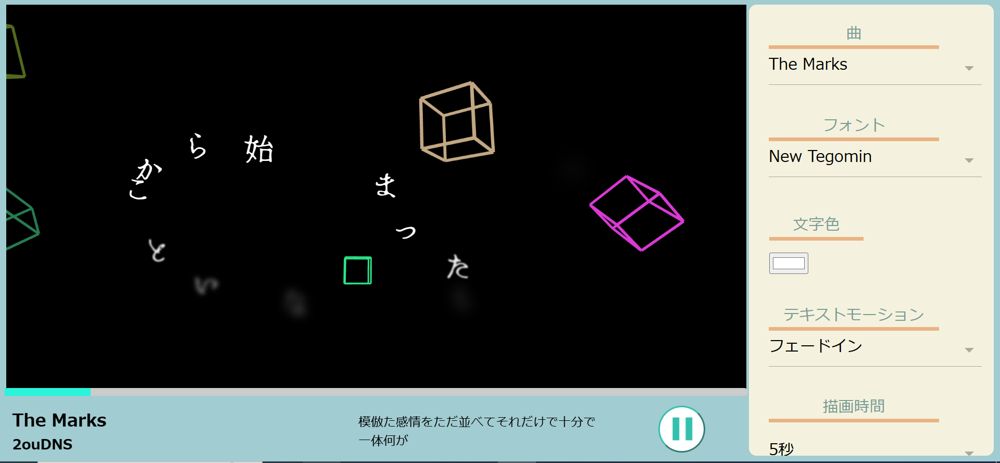

# Lyric Canvas
初音ミク「マジカルミライ2024」プログラミング・コンテストに応募した作品です。4人チームで作成しました。
デモ動画：https://youtu.be/emWsGPH_wdg

 

## アプリ概要
コンセプトは「自分だけのオリジナルリリックビデオを作ろう」。選択した曲に合わせてカーソルから歌詞が表示されるので、思うままに動かすことでオリジナルリリックビデオを楽しむことができます。

 

## 使用技術
- HTML/CSS
- JavaScript
- p5.js
- TextArive App API

PCでの使用を想定しています

 

## 担当箇所
APIとの通信、音楽再生、歌詞表示、音楽やフォントの変更機能などの基本機能を作成しました。演出の作成も一部しています。

 

## エピソード
せっかくだからGitHubを使ってみようということになり、見よう見まねで使ってみたりしました。プルリクエストが何か分からなかったので、コンフリクトが起こらないように1つのファイルを複数人で編集しないというルールを設けていました。

## アプリ画面
右側のメニューから曲やフォント、モーションなどが選べる

曲を再生すると、歌詞がタイミングに合わせてカーソルの位置に表示される。背景の四角は曲のビートに合わせて動く

